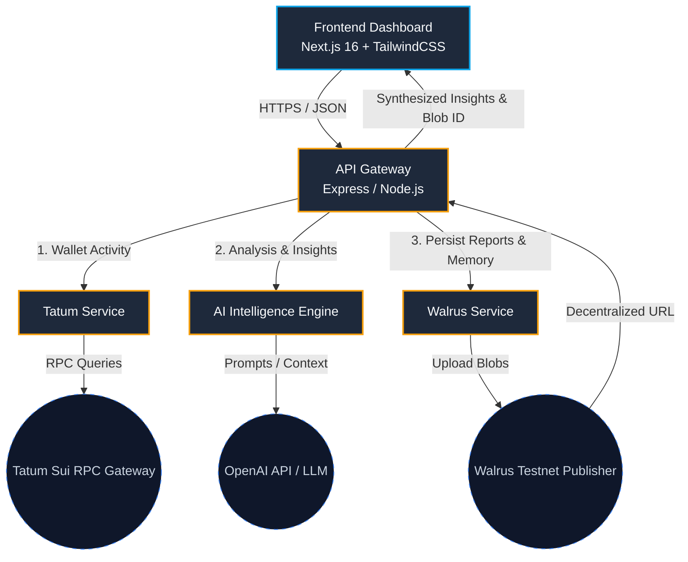

# SuiLens AI

### *Your AI Copilot for Onchain Intelligence on Sui*

[](https://sui.io/)
[](https://walrus.xyz/)
[](https://tatum.io/)
[](https://opensource.org/licenses/MIT)

---

## 📖 Overview

**SuiLens AI** is an AI-powered onchain research assistant and intelligence platform built specifically for the **Sui ecosystem**. The platform empowers DeFi traders, Web3 researchers, and beginners by translating raw, complex blockchain records into simple, actionable insights.

By combining enterprise-grade Sui blockchain access through **Tatum RPCs**, deep AI-driven analytics, and decentralized, immutable storage powered by the **Walrus Protocol**, SuiLens AI provides a comprehensive "ChatGPT-like" experience for wallet auditing, risk profiling, and smart money detection.

---

## ✨ Core Features

### 🧠 1. AI Wallet Analyzer
Paste any Sui wallet address and instantly analyze:
* **Transaction History & Volume Trends**: Understand wallet activity peaks and behaviors.
* **Asset Allocation & Token Diversity**: Discover the distribution of assets.
* **Scoring Metrics**: Receive a synthesized **Risk Score**, **Smart Money Score**, **Whale Score**, and **Scam Probability**.

### 🛡️ 2. Rug Pull & Risk Exposure Detection
* **Suspicious Protocol Monitoring**: Automatically flag interactions with unverified smart contracts.
* **Honeypot & Concentration Analysis**: Detect high-exposure risks in low-liquidity pools and concentrated holdings.
* **AI Explainer**: Translates technical vulnerabilities into plain language:
  > *"This wallet has interacted with 7 high-risk meme tokens with low liquidity and concentrated team ownership."*

### 📄 3. AI Portfolio Report Generator
* **Interactive Summaries**: Get complete trading behavior insights (e.g., *"Speculative momentum trader"*).
* **Exportable Formats**: Generate downloadable, professional, and visually stunning PDF portfolio reports.

### 🐋 4. Whale & Smart Money Tracker
* **Accumulation & Distribution Alerts**: Observe token accumulation cycles of highly profitable addresses.
* **AI Market Commentary**: Contextual explanations of whale activities and token flows on the Sui network.

### 💬 5. Natural Language Crypto Copilot
* **Interactive Chat UI**: Directly interrogate any wallet's history using normal human speech.
* **Example Prompts**:
  * *"Is this wallet smart money?"*
  * *"Explain this wallet's activity like I'm 5."*
  * *"Show me the biggest risks in this portfolio."*

### 🦭 6. Walrus Decentralized Memory
Walrus is deeply integrated into SuiLens AI's core architecture, providing:
* **Immutable Analytics Archive**: Every analysis report and PDF snapshot is uploaded to Walrus storage nodes.
* **Persistent AI Context**: Chat histories, model memory snapshots, and wallet historical states are preserved in decentralized memory blobs for absolute verifiability.

---

## 📐 System Architecture

SuiLens AI is designed with a modern, modular architecture.



### 🔁 The AI Analysis Lifecycle
1. **Input**: User submits a Sui wallet address in the Next.js frontend.
2. **Fetch**: The API gateway queries the **Tatum Sui RPC API** for transaction logs, token balances, and contract metadata.
3. **Analyze**: The **AI Engine** runs the retrieved data through the risk and scoring pipeline.
4. **Persist**: The final structured report and wallet snapshot are sent to the **Walrus Publisher** node to get a permanent decentralized blob ID.
5. **Serve**: The system serves the beautiful interactive dashboard to the user, complete with a contextual chatbot pre-loaded with the Walrus-hosted analysis history.

---

## 🛠️ Tech Stack

### Client (Frontend)
* **Framework**: Next.js 16 (App Router, React 19)
* **Styling**: TailwindCSS, Framer Motion (smooth, responsive micro-animations)
* **Charts**: Recharts
* **State Management**: Zustand
* **Wallet Connect**: `@mysten/dapp-kit` & `@mysten/sui`

### Server (Backend)
* **Runtime**: Node.js & TypeScript (`ts-node-dev`)
* **Framework**: Express.js
* **Blockchain Integrations**: Tatum SDK (Managed Sui Mainnet & Testnet Gateways)
* **Storage**: Walrus API Protocol
* **AI Model**: OpenAI API / GPT-4o

---

## 🚀 Getting Started

### 📋 Prerequisites
* **Node.js** v20 or higher
* **npm** or **yarn** / **pnpm**
* A Tatum API key ([Get one here](https://tatum.io/))
* An OpenAI API key

---

### ⚙️ 1. Backend Server Setup

1. **Navigate to the server directory:**
   ```bash
   cd server
   ```

2. **Install dependencies:**
   ```bash
   npm install
   ```

3. **Configure Environment Variables:**
   Create a `.env` file in the `server` root directory:
   ```env
   PORT=3001
   TATUM_API_KEY=your_tatum_sui_mainnet_gateway_key
   OPENAI_API_KEY=your_openai_api_key
   WALRUS_PUBLISHER_URL=https://publisher.walrus.storage
   ```
   Prisma Client generation is now automatic for `npm run dev`, `npm run build`, and `npm start`.
   If needed, you can still run it manually:
   ```bash
   npm run prisma:generate
   ```
   
4. **Run the development server:**
   ```bash
   npm run dev
   ```
   *The gateway will start running on [http://localhost:3001](http://localhost:3001).*

---

### 💻 2. Frontend Client Setup

1. **Navigate to the client directory:**
   ```bash
   cd ../client
   ```

2. **Install dependencies:**
   ```bash
   npm install
   ```

3. **Run the Next.js development server:**
   ```bash
   npm run dev
   ```
   *Open [http://localhost:3000](http://localhost:3000) in your browser to view the application.*

---

## ⚡ Key Integrations Explained

### 🍊 Tatum Sui RPC Gateway
We leverage Tatum to provide enterprise-grade RPC infrastructure without the overhead of node management:
* Queries wallet balances across multiple Sui tokens.
* Extracts historical transfer activities and transaction records quickly.
* Feeds cleanly indexed JSON lists directly into the AI analyzer pipeline.

### 🦭 Walrus Decentralized Storage
Instead of relying on a centralized database that could lose records, all generated analysis reports are committed to Walrus storage:
* **Upload**:
   We upload JSON report payloads via HTTP PUT requests to the Walrus publisher nodes (`https://publisher.walrus.storage/v1/blobs?epochs=1`).
* **Retrieval**:
  The resulting `blobId` acts as an immutable content-addressable hash. Reports are served on the UI instantly using the Walrus testnet aggregator gateway:
  `https://aggregator.walrus-testnet.walrus.space/v1/blobs/[blobId]`.

---

## 📊 AI Scoring Metrics

| Metric | Score Range | Description |
| :--- | :--- | :--- |
| **Risk Score** | `0 - 100` | Overall risk based on wallet age, liquidity exposure, and unverified contracts. |
| **Smart Money Score** | `0 - 100` | Profitability ratio, early protocol adoption, and swap efficiency. |
| **Whale Activity Score**| `0 - 100` | Asset concentration, absolute balance value, and transaction size weight. |
| **Scam Exposure Score** | `0 - 100` | Frequency of interaction with blacklisted/rug-pulled tokens on Sui. |

---

## 📂 Project Structure

```txt
SuiLens-AI/
├── client/                 # Next.js Frontend App
│   ├── src/
│   │   ├── app/            # Dashboard page views, routes, layout
│   │   ├── components/     # UI elements, widgets, charts, WalrusBadge
│   │   ├── lib/            # Helper functions & API connectors
│   │   └── store/          # Zustand states for wallets and history
│   ├── package.json
│   └── tsconfig.json
│
├── server/                 # Express Backend API Gateway
│   ├── src/
│   │   ├── controllers/    # Route handler controllers
│   │   ├── routes/         # API endpoint routers
│   │   └── services/       # AI, Tatum, & Walrus storage connectors
│   ├── .env                # Port, API keys, Walrus credentials
│   ├── package.json
│   └── tsconfig.json
│
├── architecture.md         # Full Technical Architecture specs
├── project_brief.md        # Original Project Overview & Philosophy
└── README.md               # Quick-start manual (This file)
```

---

## 📄 License
This project is licensed under the **MIT License**. Feel free to use, modify, and extend this project for hackathons or your own dApps.